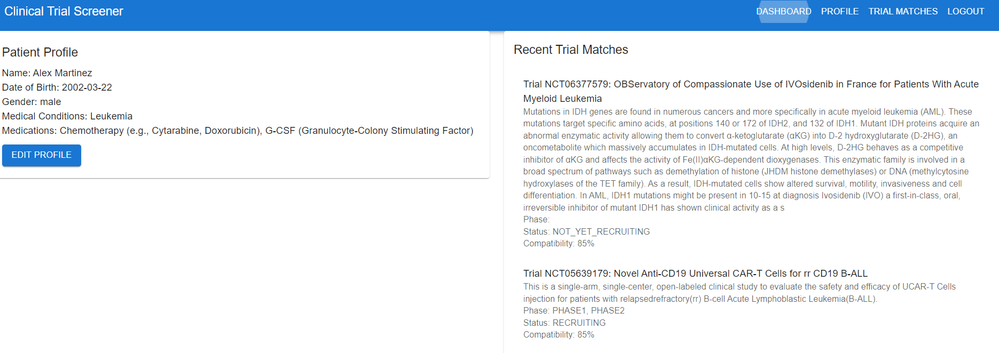
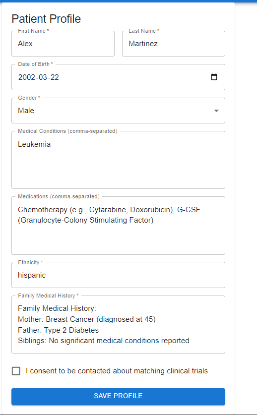
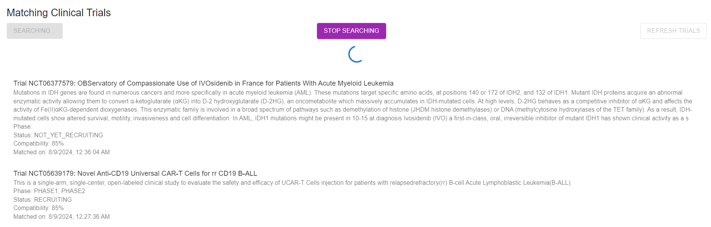

# Clinical Trial Eligibility Screener

## Table of Contents
1. [Project Overview](#project-overview)
2. [Key Features](#key-features)
3. [Technologies Used](#technologies-used)
4. [LLM Security Measures](#llm-security-measures)
5. [Agentic Capabilities](#agentic-capabilities)
6. [API Integrations](#api-integrations)
7. [Installation and Setup](#installation-and-setup)
8. [Usage](#usage)
9. [Security Considerations](#security-considerations)
10. [Contributing](#contributing)
11. [License](#license)

## Project Overview

The Clinical Trial Eligibility Screener is an advanced, AI-powered application designed to match patients with potentially suitable clinical trials based on their medical profiles. By leveraging the Anthropic API and the Claude 3.5 Sonnet model, this system automates the process of analyzing complex eligibility criteria and finding appropriate trials for patients.

*Figure 1: Dashboard view showing patient profile and recent trial matches*

## Key Features

1. **Automated Trial Fetching**: Regularly retrieves and processes clinical trial data from ClinicalTrials.gov.
2. **AI-Powered Eligibility Analysis**: Utilizes Anthropic's Claude 3.5 Sonnet model to analyze eligibility criteria.
3. **Intelligent Patient-Trial Matching**: Employs AI to match patient profiles with suitable trials.
4. **Proactive Searching**: Continuously searches for new trials that match existing patient profiles.
5. **Automated Notifications**: Sends email notifications to patients when new matching trials are found.
6. **User-Friendly Interface**: Provides an intuitive web interface for patients to manage their profiles and view matches.

*Figure 2: Patient profile input form*

## Technologies Used

- **Backend**: Flask (Python)
- **Database**: MongoDB
- **AI/ML**: Anthropic API (Claude 3.5 Sonnet model)
- **Asynchronous Programming**: asyncio, aiohttp
- **Task Scheduling**: APScheduler
- **Email Service**: SendGrid API
- **Frontend**: React.js

## LLM Security Measures

1. **Input Sanitization**: 
   - Implements rigorous sanitization of all inputs before processing by the LLM to prevent prompt injection attacks.
   - Utilizes the `sanitize_input()` function in `app/utils/input_sanitizer.py` to clean user inputs.

2. **Output Filtering**: 
   - Implements strict output parsing and filtering to ensure only relevant and safe information is processed.
   - Uses the `_parse_matching_response()` method in `app/services/anthropic_service.py` to validate and filter LLM outputs.

3. **Rate Limiting**: 
   - Enforces API rate limits to prevent abuse and ensure fair usage.
   - Utilizes Flask-Limiter for API endpoint rate limiting.

4. **Secure API Key Management**: 
   - Uses environment variables for managing API keys, as seen in `app/config.py`.

5. **Least Privilege Principle**: 
   - The LLM is only given access to necessary information for each task, minimizing potential data exposure.

## Agentic Capabilities

The Clinical Trial Eligibility Screener demonstrates agentic AI capabilities through:

1. **Autonomous Decision Making**: Independently analyzes trial eligibility criteria and determines patient compatibility.
2. **Proactive Searching**: Continuously and autonomously searches for new relevant trials.
3. **Multi-step Reasoning**: Breaks down complex eligibility criteria into manageable steps for analysis.

*Figure 3: Interface showing matching clinical trials with compatibility scores*

## API Integrations

1. **Anthropic API**: 
   - Used for: Analyzing eligibility criteria, matching patients to trials
   - Model: Claude 3.5 Sonnet
   - Key Features: Advanced language understanding, medical knowledge, multi-step reasoning

2. **ClinicalTrials.gov API**:
   - Used for: Fetching up-to-date clinical trial data
   - Endpoints: /api/v2/studies

3. **SendGrid API**:
   - Used for: Sending email notifications to patients

4. **Internal RESTful API**:
   - Endpoints for user management, patient profiles, trial matching

## Usage

1. **Patient Profile Creation**:
   Users can create and update their medical profiles through the web interface, as shown in Figure 2.

2. **Viewing Matched Trials**:
   Patients can view their matched trials, including compatibility scores and trial details, as illustrated in Figure 3.

3. **Receiving Notifications**:
   Users will receive email notifications when new matching trials are found.

## Security Considerations

- Strict access controls and authentication mechanisms are in place.
- The application implements thorough input sanitization and output filtering to prevent LLM-based attacks.
